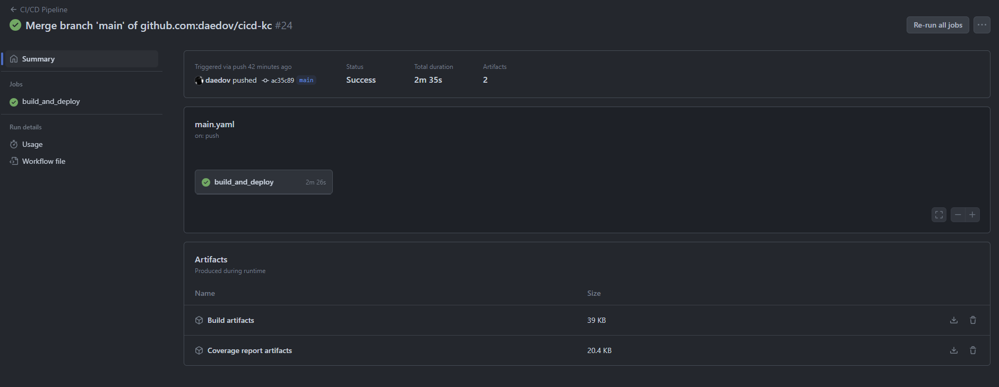
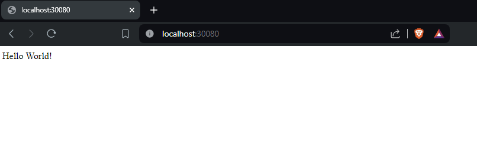
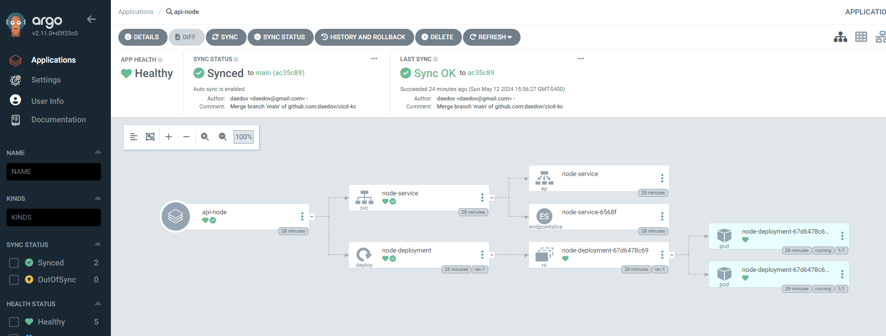
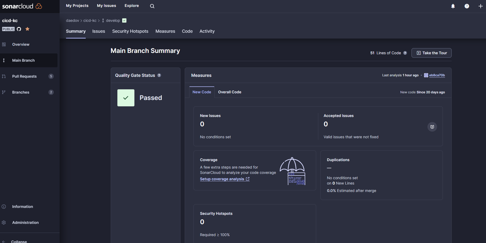
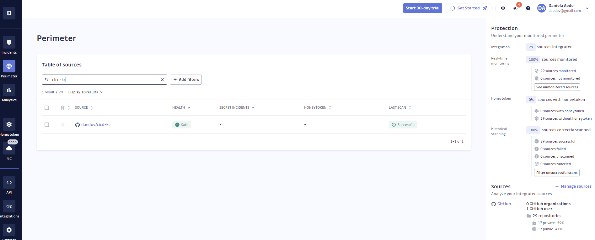

# Práctica CI/CD

## Descripción

Para la práctica se debe implementar un pipeline de CI/CD para una aplicación. La aplicación debe poder ejecutarse en un contenedor de Docker y utilizar git flow para la gestión de ramas.

### El pipeline de CI tiene que:

- Construir la aplicación.
- Ejecutar los tests de la aplicación.
- Generar un informe de cobertura de los tests.
- Ejecutar el linting de la aplicación.
- Ejecutar un análisis estático de código.
- Ejecutar un analisis de vulnerabilidades.
- Generar un artefacto de la aplicación.
- Publicar el artefacto en un repositorio de artefactos.
- Desplegar en un cluster de Kubernetes usando ArgoCD en la rama master/main.

### Entregables:

- El enlace al repositorio de artefactos: [ir al repositorio](https://hub.docker.com/repository/docker/daedov1/app-cicd/general)
- El fichero de configuración del pipeline de CI/CD: [ir al fichero](/.github/workflows/main.yaml)
- Screenshot del pipeline de CI/CD:

- Los manifestos de Kubernetes para el despliegue de la aplicación: [ir a manifiestos](./k8s/)
- Screenshot de la aplicación desplegada:

- Screenshot del proyecto en ArgoCD:

- Screenshot del proyecto en SonarCloud:

- Screenshot del proyecto en GitGuardian:

- Enlace a vídeo: